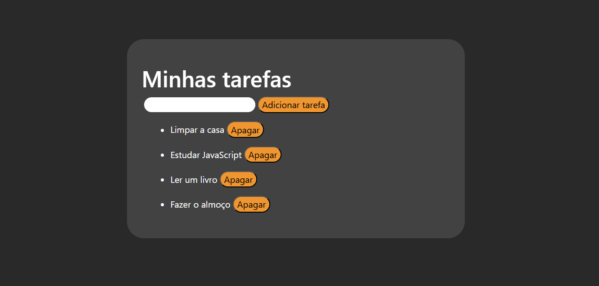

# Lista de tarefas

## Descrição geral
Este projeto é uma aplicação simples de lista de tarefas que permite adicionar, visualizar e gerenciar tarefas, garantindo a persistência dos dados em um arquivo JSON. A importância desse projeto está na prática do manuseio de arquivos, armazenamento estruturado de informações e manipulação de dados em formato JSON, algo essencial para muitas aplicações. O desenvolvimento envolveu a criação de funções para adicionar itens, salvar e carregar tarefas do arquivo JSON, garantindo que as informações permaneçam disponíveis mesmo após o encerramento do programa. Essa abordagem proporciona uma base sólida para projetos mais complexos que necessitam de armazenamento local.

## Tecnologias usadas:

## Objetivos

- [x] Testar meus conhecimentos em JavaScript;
- [x] Me aprofundar sobre o que é JSON e como funciona;
- [x] Práticar a interação entre HTML, CSS e JS;

## Links

[Link para demonstração ao vivo](https://willruty.github.io/To-do-List/)

